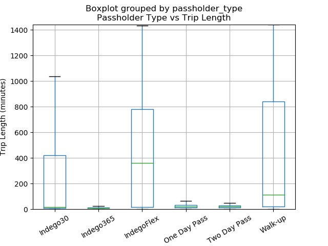
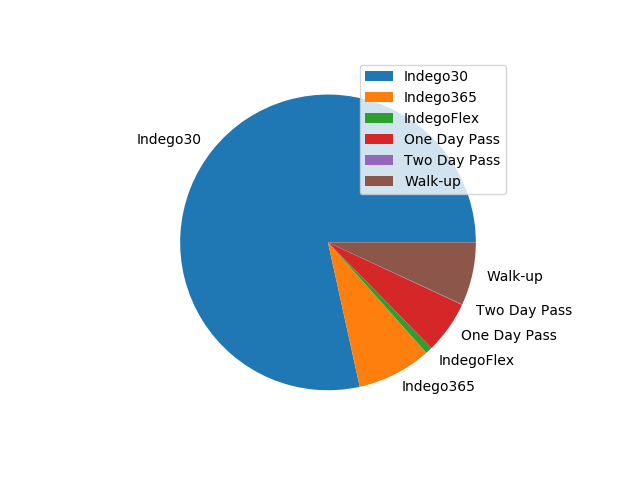
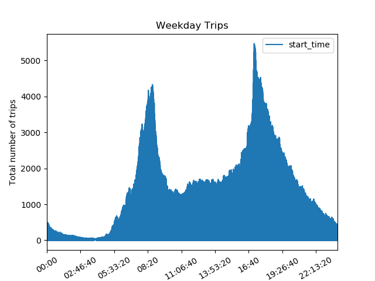
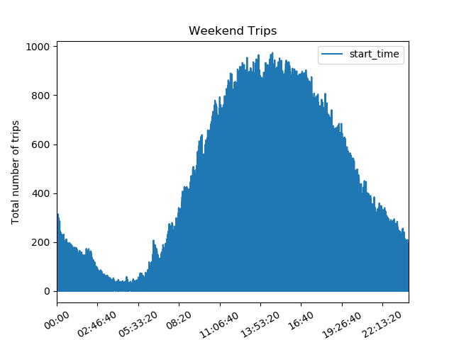
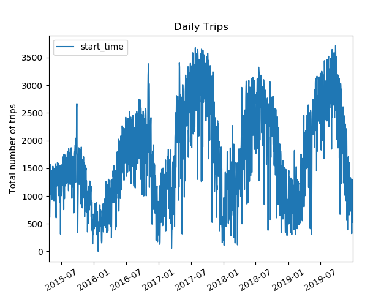
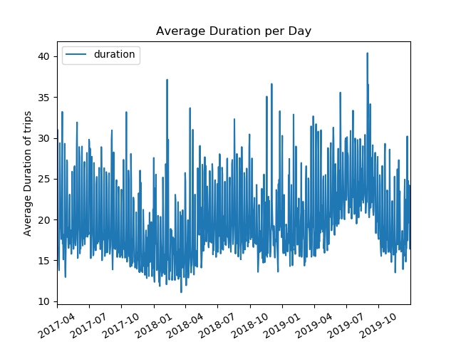
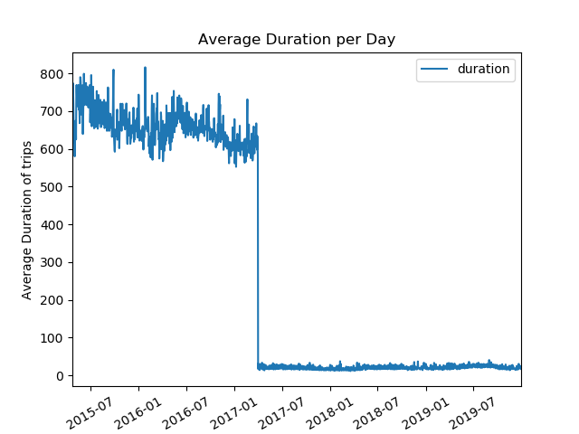

# Analysis of Philadelphia Bike Usage
Craig Fox

I analyzed data on Philadelphia bikeshare rides (source 1). The dataset needed to be sanitized for errors. The first thing was replacing the 'Day Pass' in 'passholder_type' with 'One Day Pass'. Before the launch of the Two Day Pass, the One Day Pass was only called 'Day Pass' but afterwards it was changed to 'One Day Pass' so this needed to be resolved. The next change I performed was the removal of any trip that started or ended at a Virtual Station (station_id 3000). These trips were either for special events or errors in the system, so for I thought it would be best to remove them. Finally, I removed all trips longer than 24 hours (i.e. a duration longer than 24*60 (duration is measure in minutes)). In all the data post- Q2 2017, this is done but before then it is not. These trips should only occur because of user or system errors and as such are not accurate representations. The most interesting cleanse performed was regarding trip duration. Before 2017 Q2, Indego faced docking errors where the bike would lock into the bock and end the ride for the user but the RFID would not register and the proper time would not be recorded. The difference in duration this can cause is immense as seen in Figure 7. Other than the duration, the data is accurate and so was only removed when duration was used in the graph. Figure 6 is a version of Figure 6 limited after the correction.

My first analysis of the data was a box graph of the duration of trips by passholder type (figure 1). The year and month passes have the lowest trip length. This is mostly because these users have a set commute time that is relatively small, while other users could be using the bike for extended periods of time to tour the city. Every passholder type has an average below 30 minutes. While this is likely in part due to users replacing longer rides with other forms of transportation (rideshare, public transit, etc), it could also be partially explained by many of the short-term passes (here defined as not a yearly or monthly pass) charging by the half hour.

My second analysis was a pie chart of the number of trips by passholder type (figure 2). It shows that overwhelming Indego30 passholders perform the largest number of trips. Two Day Passes and Walk-up passes have both been discontinued which explains their low percentage. The customers who used these passes will likely shift into the One Day Pass, so in the future this will likely grow to the size of the One Day Passes, Two Day Passes, and Walkups combined.

My third set of graphs shows trips by time of day for the weekend vs the weekday (figure 3 and 4). Unsurprisingly there are huge spikes around 8 AM and 5 PM for weekday ones. The weekend graph never really spikes but instead gradually increases until it peaks at 1-2 PM. The low point for weekend trips is about a hour later than on weekdays as more people are staying out late.

Unsurprisingly bike usage declines in the winter (figure 5). Bikeshare rides have also gradually increased in the years since its launch.

Figure 1

Figure 2

Figure 3

Figure 4

Figure 5

Figure 6

Figure 7

* The first quarter of operation (Q2 2015) began with the launch of Indego on April 23 and thus is 22 days shorter than the rest of the quarters
* Trips under 1 min are removed from the dataset as these are typically due to user error

1. Indego. “Philadelphia Bikeshare Data.” 2019. https://www.rideindego.com/about/data/
