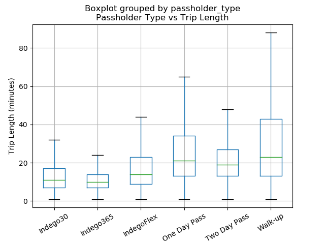

# Analysis of Philadelphia Bike Usage
Craig Fox

I analyzed data on Philadelphia bikeshare rides (source 1). The dataset needed to be sanitized for errors. The first thing was replacing the 'Day Pass' in 'passholder_type' with 'One Day Pass'. Before the launch of the Two Day Pass, the One Day Pass was only called 'Day Pass' but afterwards it was changed to 'One Day Pass' so this needed to be resolved. The next change I performed was the removal of any trip that started or ended at a Virtual Station (station_id 3000). These trips were either for special events or errors in the system, so for I thought it would be best to remove them. Finally, I removed all trips longer than 24 hours (i.e. a duration longer than 24*60 (duration is measure in minutes)). In all the data post- Q2 2017, this is done but before then it is not. These trips should only occur because of user or system errors and as such are not accurate representations.

My first analysis of the data was a box graph of the duration of trips by passholder type (figure 1). IndegoFlex has the lowest cost per hour for trips, so it makes sense for longer trips to use this plan and for it to have the highest average trip length. Walk-ups have the second lowest cost per hour and additionally are probably composed of people who are unfamiliar with the pricing structure of Indego which would explain their high average. Indego30 has a normal average but comparatively high upper quartile. My guess is that these riders are people temporarily living in Philadelphia for a month or two. This demographic would probably use the bikes daily like a regular commuter on a yearly pass would, but would also probably take long trips on the weekend as a tourist on a Flex pass would.

My second analysis was a pie chart of the number of trips by passholder type (figure 2). It shows that overwhelming Indego30 passholders perform the largest number of trips. Two Day Passes and Walk-up passes have both been discontinued and combined into the one day pass grouping, so when these are grouped together they make the second largest category.

Figure 1

Figure 2

* The first quarter of operation (Q2 2015) began with the launch of Indego on April 23 and thus is 22 days shorter than the rest of the quarters
* Trips under 1 min are removed

1. Indego. “Philadelphia Bikeshare Data.” 2019. https://www.rideindego.com/about/data/
